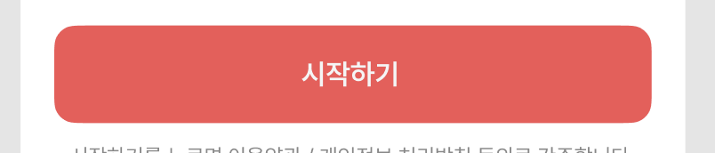
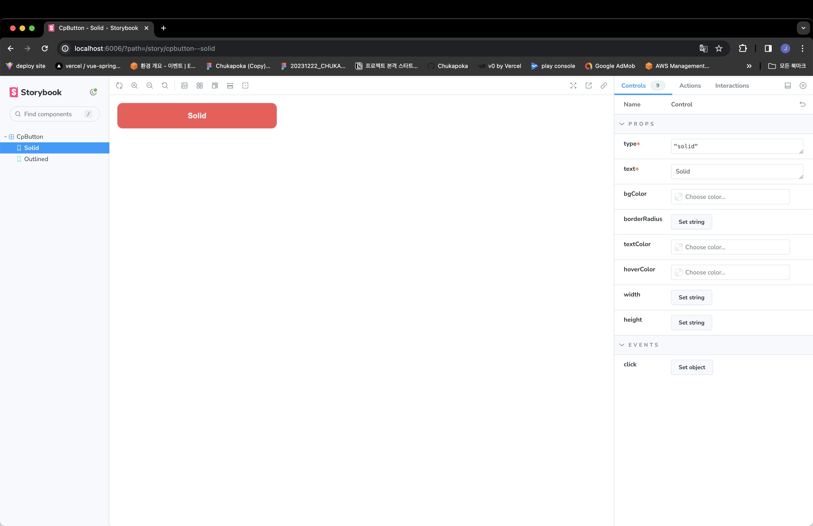
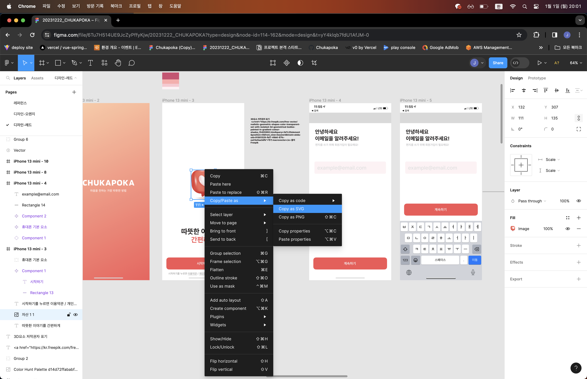

# 프론트 개발 방법

## 1. Vue Component

### 1.1 피그마 UI 디자인 확인

- https://www.figma.com/file/6Tu7H514UE9JcZyPffyKjw/20231222_CHUKAPOKA?type=design&node-id=16-766&mode=design&t=yY4klqb7fdU1AfJM-0
- 공통 컴포넌트 요소 확인
- 예제로 해당 버튼을 공통 컴포넌트화 진행
  - https://www.figma.com/file/6Tu7H514UE9JcZyPffyKjw/20231222_CHUKAPOKA?type=design&node-id=115-297&mode=design&t=yY4klqb7fdU1AfJM-4
  - 

### 1.2 element-plus에서 참고할 컴포넌트 찾기

- 버튼이기에 ElButton 활용
  - https://element-plus.org/en-US/component/button.html#basic-usage

### 1.3 피그마 UI 디자인의 css 속성(property) 확인

- 전체 페이지에서 사용되는 색상, 텍스트의 typography, 텍스트 데이터 변경 유무 등

### 1.4 해당 공통 컴포넌트는 `components/commons`에 개발

### 개발 완료 후 해당 공통 컴포넌트의 storybook 작성

### 예제 결과물 확인

- `components/commons/CpButton.vue`
  - npm i && npm run dev
- `components/commons/CpButton.stories.ts`
  - npm run storybook
- `assets/colors.scss`
- `assets/typography.scss`
- `assets/variables.scss`
- 필요한 경우, `.storybook/main.ts`, `.storybook/preview.ts`의 설정 참고(element-plus, scss 적용)

  - 

## 2. Svg Icon Vue 컴포넌트화

### 2.1 피그마 UI 디자인 확인

- https://www.figma.com/file/6Tu7H514UE9JcZyPffyKjw/20231222_CHUKAPOKA?type=design&node-id=16-766&mode=design&t=yY4klqb7fdU1AfJM-0
- 공통 컴포넌트 요소 확인
- 예제로 해당 아이콘을 컴포넌트화 진행
  - https://www.figma.com/file/6Tu7H514UE9JcZyPffyKjw/20231222_CHUKAPOKA?type=design&node-id=114-162&mode=design&t=yY4klqb7fdU1AfJM-4
  - 

### 2.2 아이콘 Vue 컴포넌트화

- `components/commons/images`에 Vue 컴포넌트 생성
- 해당 아이콘 `Copy as SVG`로 Copy
  - 
- `<template>`에 복붙
- `currentColor`, `fill` 등 스타일 지정이 필요한 경우 `props` 등을 추가

### 개발 완료 후 해당 공통 컴포넌트의 storybook 작성

### 예제 결과물 확인

- components/commons/images/CpLogo.vue
  - npm i && npm run dev
- components/commons/images/Iconography.mdx
  - npm run storybook

# 3. `containers` 등 복합 컴포넌트

    - 공통 컴포넌트를 통해 구성된 페이지의 전체 레이아웃 역시 storybook에 추가하도록 하자
